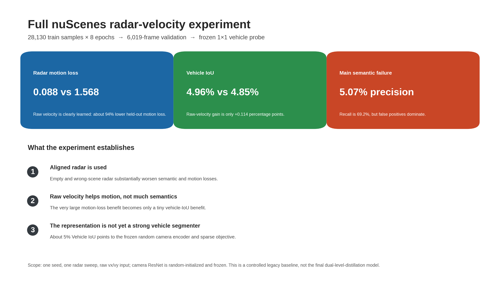
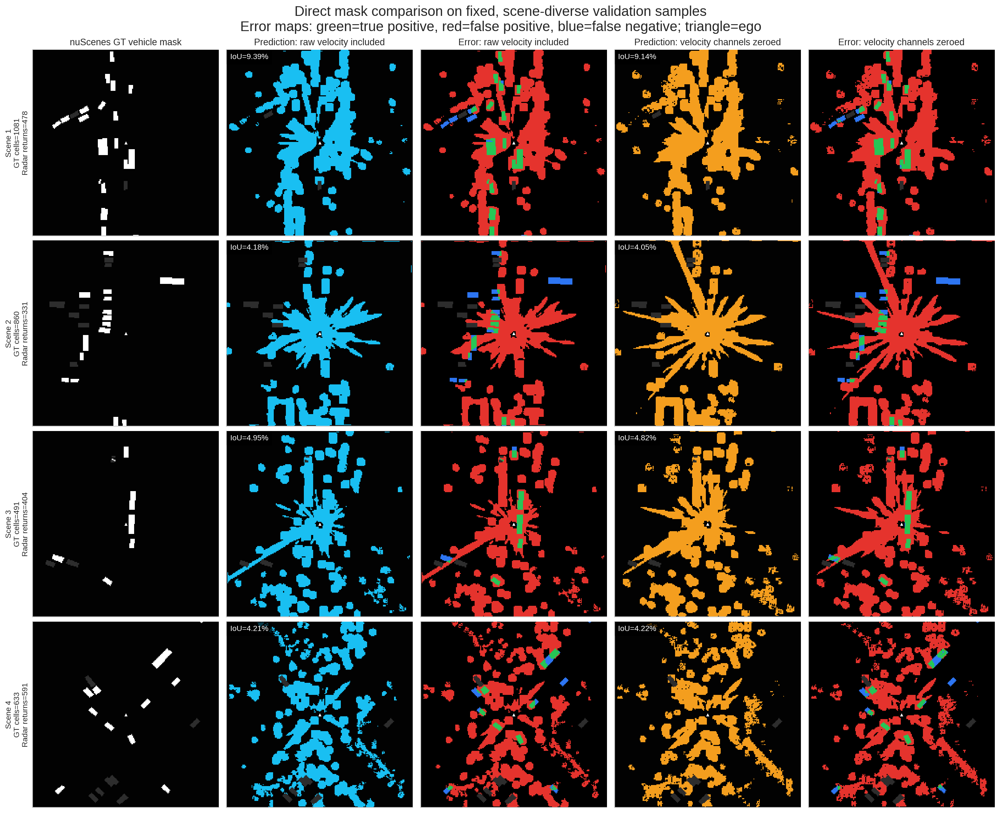
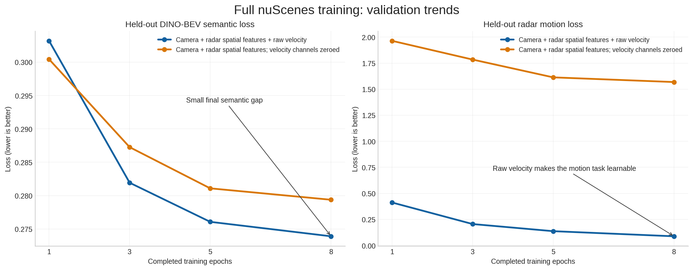
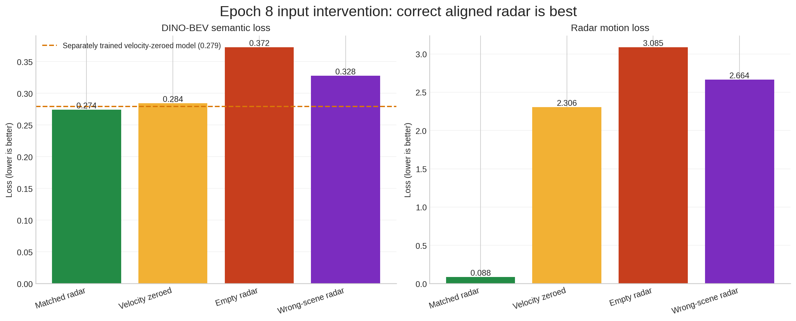
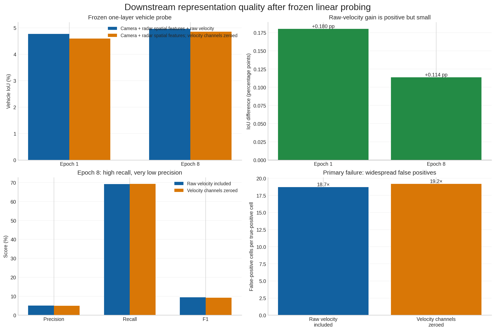

# Full-data velocity experiment: meeting visuals

This package summarizes the completed one-sweep, full-nuScenes controlled
comparison between:

1. camera + radar spatial features + raw radar velocity; and
2. the same architecture with both raw velocity input channels zeroed during
   training and evaluation.

Both backbones used 28,130 training samples for eight epochs, seed 125, and the
same 6,019-frame validation split. The frozen downstream evaluation trained
only one `1x1` vehicle-segmentation layer. The camera ResNet remained
random-initialized and frozen, so these are legacy controlled-baseline results,
not final dual-level-distillation results.

## Recommended slide order

### 1. One-slide result overview



Talking point: raw radar velocity is clearly learned by the motion objective,
but the improvement does not transfer materially to vehicle segmentation.

### 2. Direct prediction-mask versus GT comparison



White is GT vehicle occupancy. Cyan/orange are hard prediction masks at the
locked `0.5` probability threshold. In each error map, green is true positive,
red is false positive, and blue is false negative. The triangle marks the ego
vehicle. The dominant red regions make the main failure visible: both probes
cover many true vehicles but classify far too much background as vehicle.

The four examples are reproducible and were not selected by model performance.
They come from four evenly spaced validation scenes; within each scene, the
sample nearest the temporal midpoint with at least one valid GT vehicle cell
was chosen. Exact tokens and per-sample IoUs are recorded in
`artifacts/fullsize_meeting_visuals.json`.

### 3. Training and held-out validation trends



Talking point: both semantic losses decrease, so training does not collapse.
Raw velocity makes the radar-motion task dramatically easier, while the final
semantic-loss advantage is small.

### 4. Radar input interventions



Talking point: correct aligned radar beats velocity-zeroed, empty, and
wrong-scene radar. This is evidence that the model uses the current scene's
radar and its velocity, rather than only learning a radar-branch bias.

### 5. Frozen linear-probe quality and failure mode



Talking point: the raw-velocity gain is positive but falls from `+0.180` to
`+0.114` Vehicle-IoU percentage points between epoch 1 and epoch 8. At epoch 8,
precision is only `5.07%`, and the raw-velocity model produces about `18.7`
false-positive cells per true-positive cell.

## Headline results

| Result | Raw velocity included | Velocity channels zeroed | Difference |
| --- | ---: | ---: | ---: |
| Epoch-8 motion loss | 0.0881 | 1.5684 | -1.4803 |
| Epoch-8 DINO-BEV semantic loss | 0.2739 | 0.2794 | -0.0055 |
| Epoch-8 Vehicle IoU | 4.962% | 4.848% | +0.114 pp |
| Epoch-8 precision | 5.074% | 4.955% | +0.119 pp |
| Epoch-8 recall | 69.185% | 69.271% | -0.086 pp |
| Epoch-8 F1 | 9.455% | 9.248% | +0.207 pp |

The supported conclusion is narrow: raw radar velocity strongly improves the
motion objective, and aligned radar affects both objectives, but vehicle
semantic quality remains weak. This result does not establish multi-class
semantic mIoU, statistical significance across seeds, or the quality of the
planned trainable camera encoder.

## Reproduction

```bash
MPLCONFIGDIR=/tmp/dd2414-matplotlib PYTHONPATH=scripts \
  $HOME/miniconda3/envs/bev/bin/python \
  scripts/render_fullsize_meeting_results.py
```

The script reads the completed epoch-8 backbone checkpoints, the completed
frozen linear heads, all aggregate JSON summaries, and the original nuScenes
validation samples. It does not retrain or modify a model.
