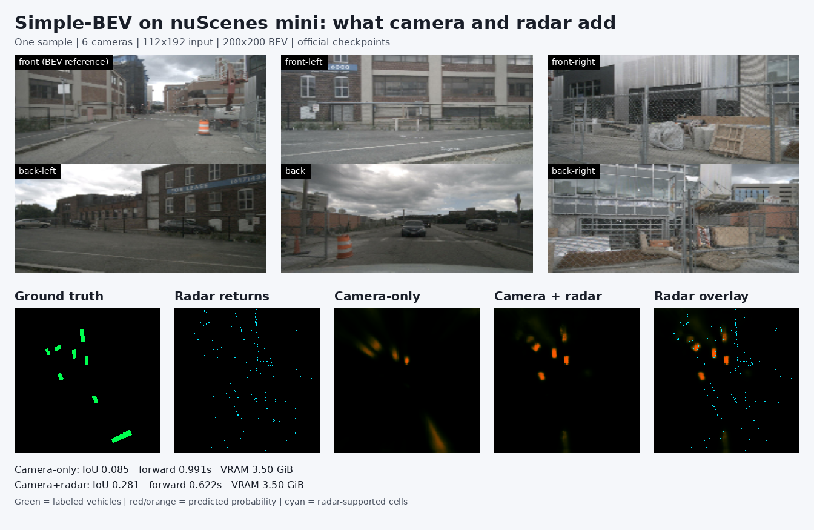
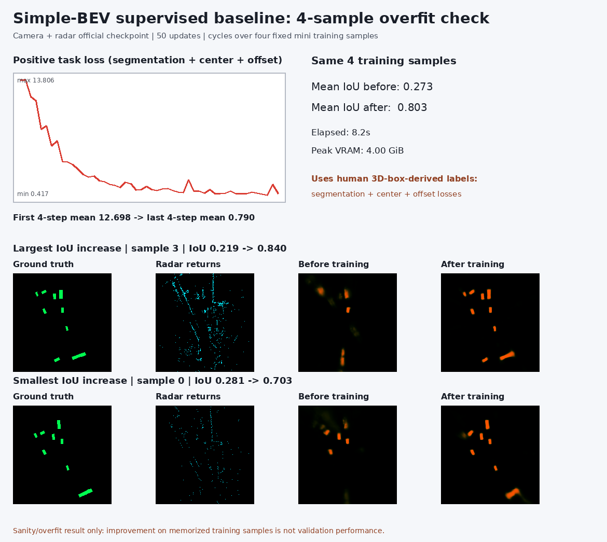
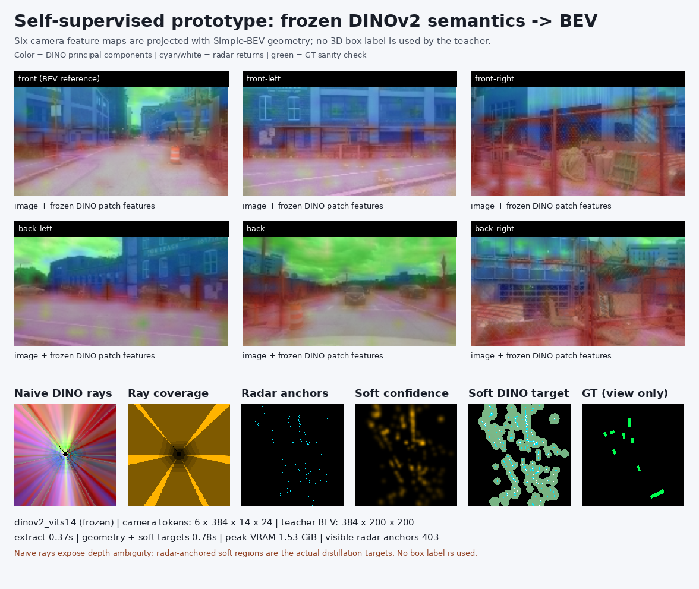
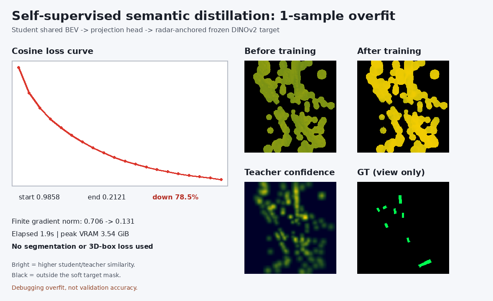
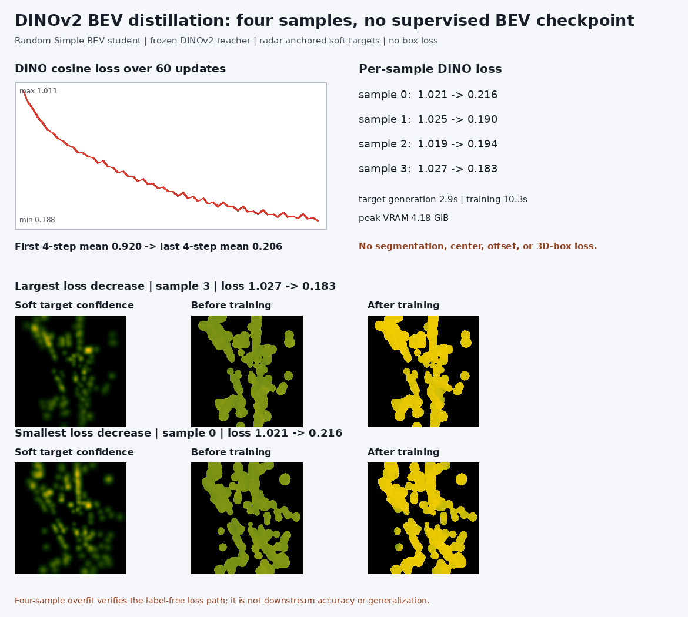
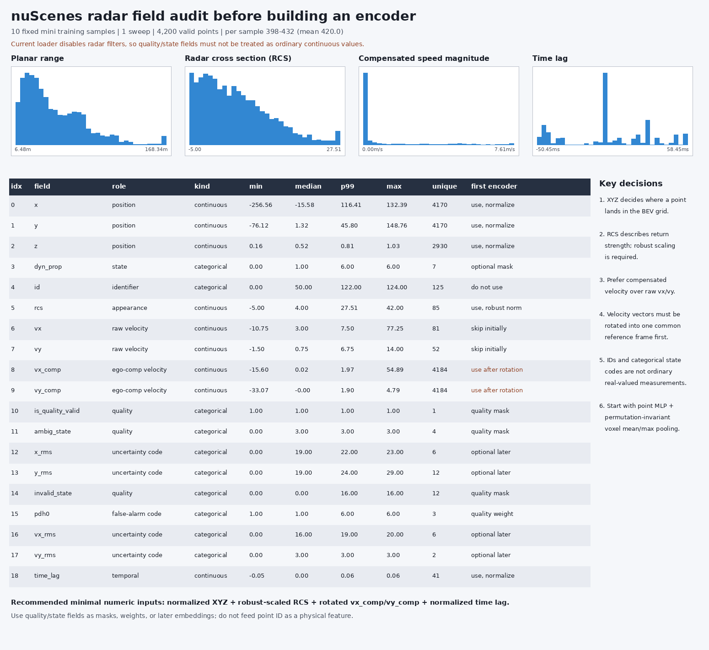

# DD2414 Project Progress: Simple-BEV and Label-Free BEV Learning

## Executive summary

2026-10-07 full-data update: the locked seed-125, one-sweep scaling study is
complete at 64, 256, 1,024, 4,096 and all 28,130 training samples. Every point
used 30,000 updates and all 6,019 validation frames. A paired 150-scene
bootstrap places the persistent semantic wrong-scene onset at 256 samples;
motion dependence is already strong at 64. Both rise through 4,096 and then
saturate or slightly decline at full scale. Matched semantic/motion losses
improve from 0.46199/1.58663 at 64 to 0.30538/0.79639 at full scale, so the
diagnostic objectives do not collapse. This remains a one-seed dependence
result with a random frozen camera encoder, not downstream vehicle IoU. See
`RADAR_SCALING_ANALYSIS.md`.

2026-10-05 trainval update: the project-pinned BEVCar `nets/voxelnet.py` was
reproduced under the latest 64-train / 16-val / 512-step / three-seed motion
protocol after replacing mini with full `v1.0-trainval`. The exact head-selected
protocol produced motion-only/joint zero-velocity penalties of `+0.0768` and
`+0.0804`; a separate uniform 64/16-scene control produced `+0.7980` and
`+0.8602`. These are bounded held-out feature-loss probes, not all-frame
pretraining or downstream segmentation accuracy. See `TRAINVAL_RUN_PLAN.md`.

We reproduced the official Simple-BEV camera-only and camera-plus-radar paths
on nuScenes mini, including data loading, inference, backward propagation,
optimizer updates, checkpoint save/reload, and visualization. We then built a
small label-free semantic-learning prototype using frozen DINOv2 features and
radar-anchored geometry. Finally, we audited the radar representation, fixed an
optional velocity-frame issue, and implemented a standalone point/voxel radar
encoder.

The current work now includes a full-train-split diagnostic study, but it is
not a matched downstream benchmark and must not be presented as final vehicle
segmentation performance or a completed self-supervised pretraining method.

## 1. Official baseline reproduction

### 1.1 Camera and radar visualization

Run:

```bash
./scripts/run_meeting_demo.sh
```



The top row contains the six images from one nuScenes sample. The loader moves
the front camera to index zero and uses it as the reference coordinate frame.
The lower panels show:

- green: BEV ground truth generated from human-annotated 3D vehicle boxes;
- cyan: radar returns projected into the reference-camera BEV;
- red/orange: predicted vehicle occupancy probability;
- camera-only: prediction from images only; and
- camera-plus-radar: prediction after adding radar information to camera BEV.

For this single low-resolution example, camera-only IoU was `0.085` and
camera-plus-radar IoU was `0.281`. A single example is useful for checking
orientation and alignment, but it cannot establish a general radar benefit.

### 1.2 Fixed 10-sample subset

To avoid reporting only one selected example, we evaluated the first ten fixed
nuScenes mini validation samples. Both models used the same six `112x192`
images and ground truth. The radar model used five sweeps, matching its official
checkpoint configuration.

```bash
./scripts/run_mini_subset_eval.sh
```

| Model | Mean IoU | Standard deviation | Mean forward time | Peak allocation |
| --- | ---: | ---: | ---: | ---: |
| Official camera checkpoint | 0.121 | 0.039 | 0.089 s | 3.52 GiB |
| Official camera+radar checkpoint | 0.291 | 0.043 | 0.092 s | 3.52 GiB |

Radar was higher on all ten samples. The visualization includes the largest,
middle, and smallest IoU differences rather than showing only the best case.


This supports the limited claim that the radar pipeline works and that the
official radar checkpoint helps on this small subset. The two checkpoints were
trained separately, so this result cannot isolate radar as the only cause and
does not replace a full-resolution, full-validation benchmark.

### 1.3 Supervised learning-loop sanity check

We deliberately overfit the first four mini training samples for 50 updates,
starting from the official camera-plus-radar checkpoint:

```bash
./scripts/run_baseline_overfit.sh
```

| Metric | Before/start | After/end |
| --- | ---: | ---: |
| Four-step mean positive task loss | 12.698 | 0.790 |
| Mean IoU on the same four training samples | 0.273 | 0.803 |

The positive task loss combines segmentation, center, and offset losses and
dropped by 93.8%. Training plus evaluation took approximately 8.2 seconds and
peaked at 4.00 GiB.



This intentionally memorized training subset proves that data, losses,
backward propagation, the optimizer, outputs, and checkpoints form a complete
learning loop. It uses box-derived labels and is neither self-supervised nor a
validation result.

## 2. Simple-BEV data and model flow

A normal image is a perspective view from inside the vehicle. A BEV is a map
viewed from above. Simple-BEV uses camera calibration to transform six
perspective feature maps into one shared spatial representation:

```text
six camera images
  -> per-camera 2D feature encoder
  -> calibrated unprojection into a shared 3D reference-camera grid
  -> sum across cameras and compress height
  -> optional radar BEV concatenation and convolution
  -> shared BEV feature
  -> segmentation, center, and offset predictions
```

Important tensors in the low-resolution tests are:

```text
input images                  (1, 6, 3, 112, 192)
packed camera features        (6, 128, 14, 24)
unprojected camera features   (1, 6, 128, 200, 8, 200)
shared BEV feature            (1, 128, 200, 200)
vehicle segmentation          (1, 1, 200, 200)
```

The five most useful code entry points are:

1. `train_nuscenes.py:main()` creates the loader, model, optimizer, and loop.
2. `nuscenesdataset.py:VizData.get_single_item()` reads sensors and targets.
3. `train_nuscenes.py:run_model()` prepares geometry, voxels, and losses.
4. `nets/segnet.py:Segnet.forward()` performs camera-to-BEV and decoding.
5. `saverloader.py` saves and restores checkpoints.

## 3. First label-free semantic prototype

### 3.1 Radar-anchored DINOv2 target

Run:

```bash
./scripts/run_dinov2_bev_demo.sh
```



The implemented target path is:

```text
six images -> frozen DINOv2-S/14 -> semantic patch features
                                         |
camera calibration + radar range --------+
                                         v
                         sample semantics at measured depths
                                         v
                         soft local BEV supervision regions
```

Measured on the first sample:

- DINOv2 parameters: 22,056,576, all frozen;
- teacher tensor: `(6,384,14,24)`;
- 403 radar returns associated with at least one camera feature;
- 16,064 of 40,000 BEV cells covered by soft regions;
- approximately 0.35 s for DINO extraction and 0.82 s for projection/targets;
- 1.53 GiB peak GPU allocation.

Directly unprojecting an image feature along a ray copies the same semantics
across unknown depths and creates radial artifacts. Radar supplies measured
range, so the loss is restricted to local areas around radar anchors. Ground
truth is shown only for human visual inspection and is not used to generate the
teacher target.

### 3.2 One-sample semantic distillation

```bash
./scripts/run_semantic_distill_smoke.sh
```

```text
Simple-BEV shared BEV feature (128 channels)
  -> trainable lightweight projection head
  -> student semantic BEV (384 channels)
  -> confidence-masked cosine loss
  -> frozen cached DINOv2 target (384 channels)
```

The 20-step debug run reduced loss from `0.9858` to `0.2039`. Gradients reached
the shared BEV compressor, checkpoint save/reload succeeded, and peak allocation
was 3.54 GiB.



### 3.3 Four-sample experiment without a supervised BEV checkpoint

This test removes the possibility that the semantic branch only inherited an
official supervised BEV representation:

```bash
./scripts/run_dinov2_mini4.sh
```

- four fixed mini training samples;
- frozen DINOv2 teacher;
- randomly initialized Simple-BEV student;
- no supervised BEV checkpoint;
- 60 alternating updates;
- cosine loss only, with no segmentation, center, offset, or box loss.

| Metric | Before/start | After/end |
| --- | ---: | ---: |
| Independent four-sample mean DINO loss | 1.023 | 0.196 |
| First/last four-step training mean | 0.920 | 0.206 |

Post-training sample losses were `0.218`, `0.189`, `0.193`, and `0.186`.
In the pre-push regression, target generation took 2.9 seconds; training and
evaluation took 10.3 seconds and peaked at 4.18 GiB.



This proves that the label-free DINO loss path can drive parameter updates. It
is still four-sample memorization, not evidence of generalization. The common
loader currently constructs labels in the background even though this
experiment never reads them into the target or loss; a strict pretraining
loader should later remove that unnecessary work.

## 4. Radar audit and minimal point encoder

### 4.1 Radar field audit

Ten fixed, one-sweep mini samples contained 4,200 finite returns, or 398-432
per frame. The 19 channels mix physical measurements, IDs, and categorical
status codes, so they should not all be standardized as continuous inputs.

The first numeric encoder uses:

```text
normalized x, y, z
robustly scaled radar cross section (RCS)
rotated and clipped compensated planar velocity
normalized signed time lag
```

Quality flags are used as masks rather than ordinary MLP values. IDs are not
used as physical features.



### 4.2 Velocity-frame correction

The nuScenes `PointCloud.transform()` used by the original loader transforms
XYZ but not radar velocity rows. Thus, positions from the five sensors share a
frame while directional velocity components remain in sensor-specific axes.

An opt-in `rotate_radar_velocity=True` path now rotates both raw and
ego-motion-compensated velocity without applying translation. It defaults to
`False` so official legacy checkpoint behavior remains unchanged.

The tests verify a synthetic 90-degree rotation, unchanged XYZ/nonvelocity
metadata, speed-magnitude preservation, and real calibration directions. The
maximum compensated-speed magnitude error was `3.4e-7` m/s.


### 4.3 Standalone minimal radar encoder

`nets/radar_encoder.py` implements:

```text
five radar sensors
  -> common reference-ego velocity frame
  -> reference-camera positions and BEV-plane velocity
  -> select and normalize seven continuous fields
  -> point MLP: 7 -> 32 -> 64
  -> mean/max pooling within 3D voxels
  -> height collapse
  -> (B,64,200,200) radar BEV
```

On the first real mini frame, 403 returns became 125 in-range,
high-confidence points occupying 123 3D voxels and 123 BEV cells. The tests
cover camera-frame transforms, finite output, empty input, ROI filtering,
point-order invariance, same-voxel collisions, and finite nonzero gradients.


This proves that the new radar path produces a geometrically aligned,
trainable BEV tensor. The weights are still random, it has not replaced the
official radar input, and it has not learned semantics or motion.

## 5. What is established and what is not

### Established in this milestone

- A real mini batch contains six images, calibration, ego pose, labels, lidar,
  and 403 valid radar points.
- Both official camera-only and camera-plus-radar checkpoints run on the GPU.
- Forward, backward, optimizer, checkpoint, and reload paths work.
- The fixed 10-sample result and supervised four-sample sanity check are
  reproducible with scripts.
- Frozen DINOv2 features and radar range produce local label-free BEV targets.
- A random student can optimize the four-sample DINO objective.
- Radar fields, quality states, velocity frames, the point encoder, and its
  camera-BEV fusion have been tested explicitly.

### Not established yet

- Small-sample IoU is not the paper benchmark or a final result.
- Four-sample DINO loss reduction is not generalization.
- PCA colors do not prove semantic quality.
- Radar Doppler is not automatically object velocity; filtering, ego motion,
  uncertainty, and coordinate frames still matter.
- The learned radar encoder is fused with camera BEV and passes a one-frame
  engineering check, but it has not yet learned useful semantics or motion.
- Motion supervision, full-mini pretraining, downstream probing/fine-tuning,
  and near/far evaluation remain future work.

## 6. Learned radar fusion integration

The standalone `(B,64,200,200)` radar encoder is now connected to the camera
BEV feature. The bounded integration test passed:

1. radar tensor shape `(1,64,200,200)` and fused shape `(1,128,200,200)`;
2. a complete forward pass and checkpoint round trip;
3. finite nonzero radar-encoder gradient norm `0.031452`;
4. finite model output with an empty radar tensor; and
5. peak allocated CUDA memory `3.440 GiB` on the 8 GiB GPU.


This does not establish accuracy because the integration test uses random
weights. The next bounded experiment is to train the fused camera-radar
representation with the existing label-free DINO target, still without a
motion head.

## 7. Suggested questions for the supervisor

1. Should the first motion head predict continuous planar velocity or only a
   static/dynamic state?
2. Is offline caching of frozen DINOv2 teacher features acceptable?
3. Should the primary downstream evaluation be a linear probe or full
   fine-tuning?
4. How should static/dynamic thresholds be defined for evaluation?
5. Which near/mid/far distance intervals should be reported?

## Short meeting summary

We reproduced the official Simple-BEV camera and camera-plus-radar pipelines on
nuScenes mini and verified inference, learning, checkpointing, and a fixed
10-sample comparison. We then froze DINOv2 and used radar range to place image
semantics in local BEV regions without box-derived losses; a randomly
initialized four-sample student reduced mean cosine loss from 1.023 to 0.196.
We also audited the radar tensor, corrected velocity-frame rotation, and built
a point/voxel encoder that outputs a tested 64-channel BEV. It is now connected
to camera BEV: the fused path passes shape, forward, gradient, empty-radar,
checkpoint, and 3.440 GiB peak-memory checks. The next step is label-free DINO
training of this fused representation before adding motion learning.
