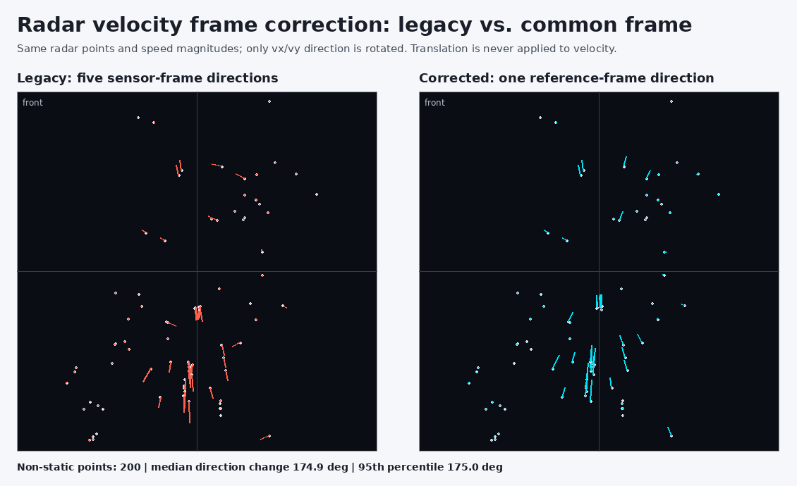
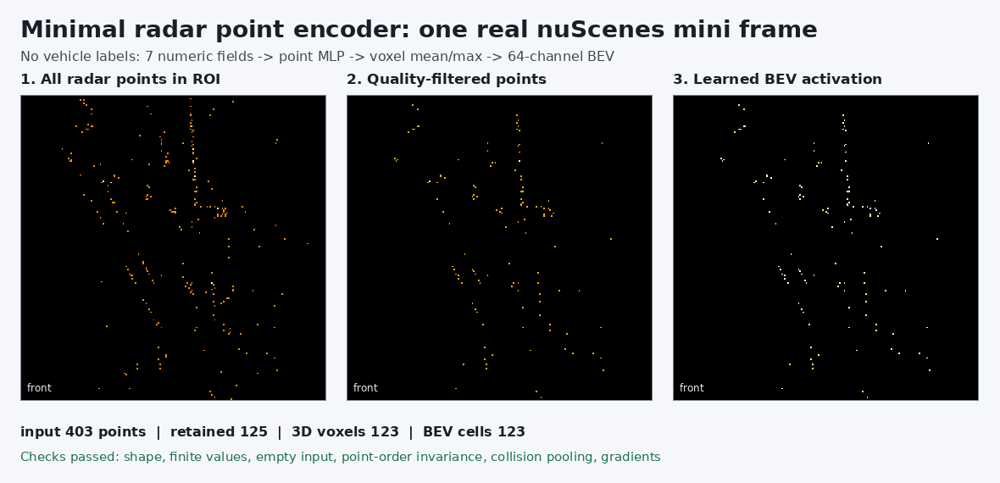
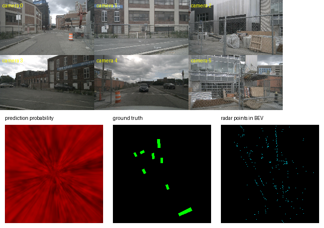
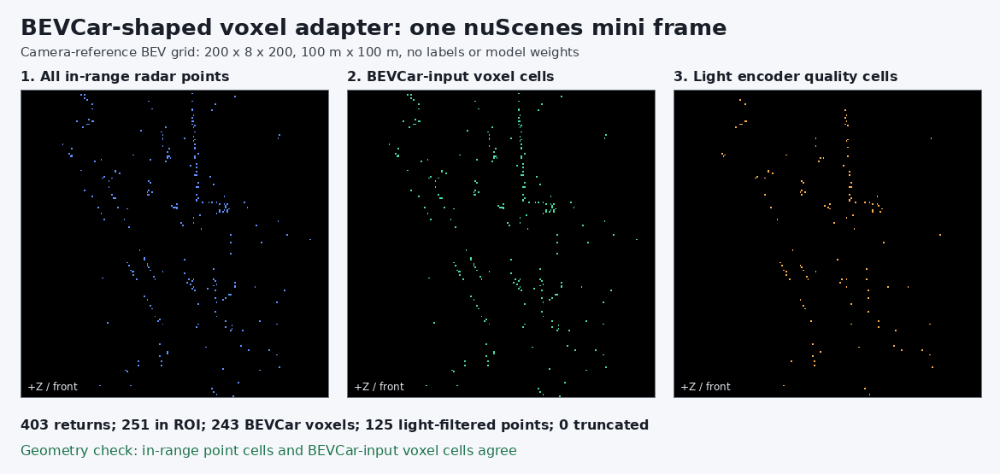
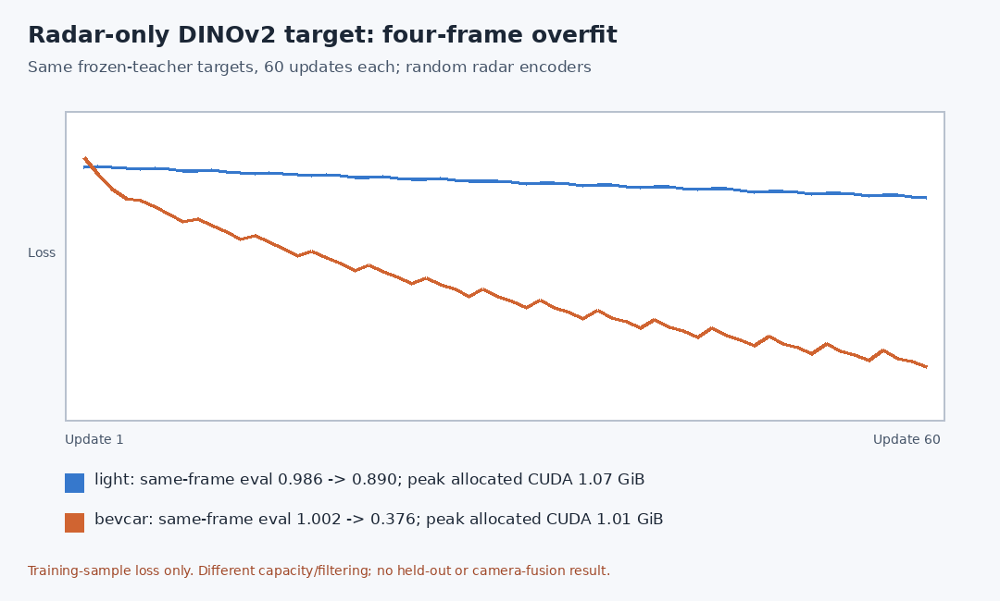
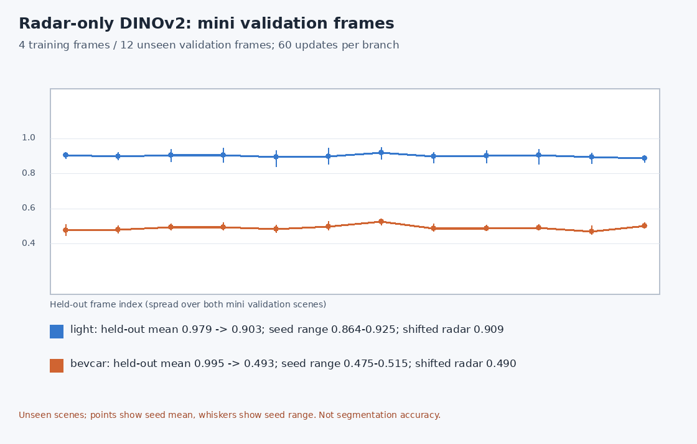
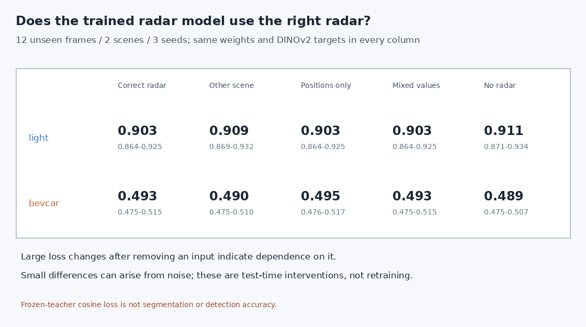
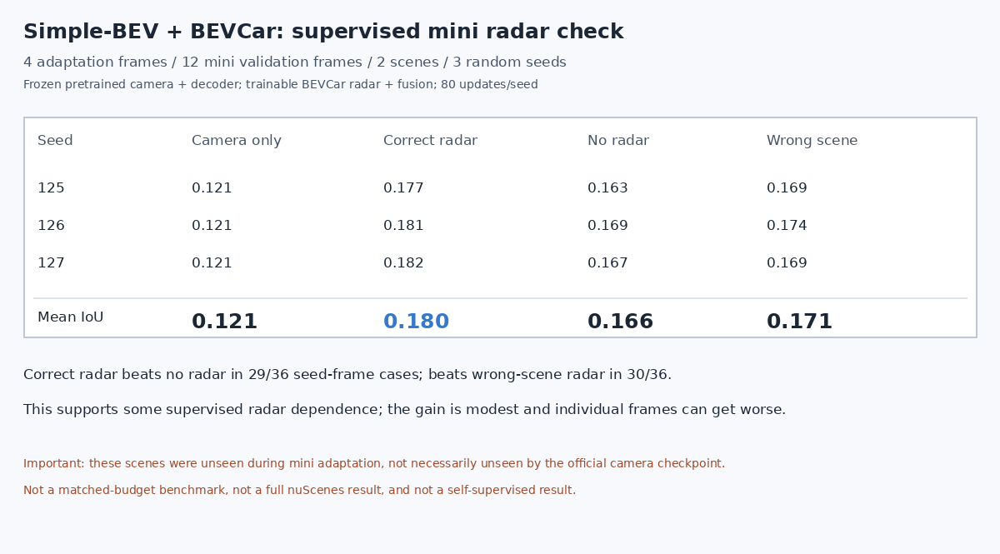
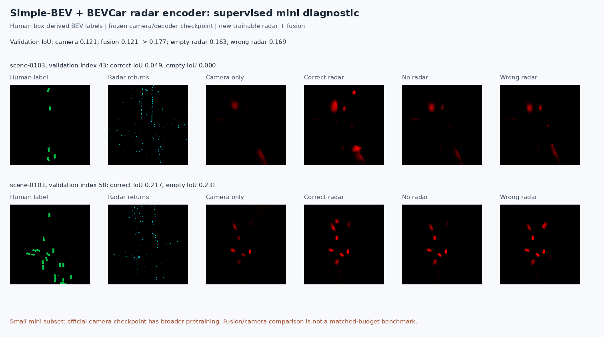

# Radar encoder data audit

## Scope

This audit is deliberately before model implementation. It inspects the exact
19-channel radar tensor that the current Simple-BEV loader returns, using the
first 10 fixed nuScenes mini training samples, one sweep, and radar filters
disabled to match the existing smoke/DINO experiments.

Run:

```bash
./scripts/run_radar_field_audit.sh
```

The sample contains 4,200 valid returns in total, 398-432 per frame (mean 420).
Every retained scalar is finite.

## The 19 fields

| Index | Field | Meaning | Initial encoder decision |
| ---: | --- | --- | --- |
| 0-2 | `x,y,z` | Point position after loader transformation | Use after ROI filtering and normalization |
| 3 | `dyn_prop` | Discrete dynamic-state code | Optional mask/embedding, not a real number |
| 4 | `id` | Radar cluster identifier | Do not use as a physical feature |
| 5 | `rcs` | Radar cross section / return strength | Use with clipping and robust scaling |
| 6-7 | `vx,vy` | Raw planar velocity | Skip initially |
| 8-9 | `vx_comp,vy_comp` | Ego-motion-compensated planar velocity | Use only after frame rotation is fixed |
| 10 | `is_quality_valid` | Discrete quality flag | Use as a mask; constant 1 in this subset |
| 11 | `ambig_state` | Doppler ambiguity code | Use as a mask/weight |
| 12-13 | `x_rms,y_rms` | Quantized uncertainty codes | Optional later embedding/weight |
| 14 | `invalid_state` | Cluster validity code | Use as a mask/weight |
| 15 | `pdh0` | Quantized false-alarm probability code | Use as a quality weight |
| 16-17 | `vx_rms,vy_rms` | Quantized velocity uncertainty codes | Optional later embedding/weight |
| 18 | `time_lag` | Difference from reference radar timestamp | Use after normalization |

These are not 19 interchangeable continuous measurements. IDs and state/RMS
codes should not be blindly standardized and passed to an MLP.

## Measured ranges and consequences

- Planar range has a 1st/99th percentile of 6.48/168.34 m. Many returns are
  outside the current 100x100 m BEV. Filter to the BEV ROI before a point MLP;
  otherwise extreme unused points still affect activations and compute.
- RCS has a 1st/99th percentile of -5.0/27.5 and a maximum of 42. Clip to robust
  percentiles before standardization.
- Compensated speed magnitude is below 7.61 m/s for 99% of returns, but isolated
  components reach 54.9 and -33.1 m/s. Velocity also needs robust clipping.
- Time lag lies between -0.0543 and 0.0584 s even with one sweep because the five
  radar timestamps are asynchronous relative to `RADAR_FRONT`. A signed time
  feature is therefore meaningful; it is not always nonnegative.
- `is_quality_valid` is 1 for 100% of these returns and cannot filter them by
  itself. Only 54.6% have `invalid_state == 0`, and 88.2% have unambiguous
  Doppler (`ambig_state == 3`). The current loader has disabled default filters.
- 46.7% have compensated speed magnitude below 0.1 m/s. Dynamic-state codes
  `[0,2,6]` mark 16.5% as moving/oncoming/crossing-moving, but this code must not
  be used as independent evaluation ground truth if it becomes a training cue.

## Critical frame issue before using velocity

`nuscenesdataset.get_radar_data()` applies `current_pc.transform(trans_matrix)`
to merge five radar sensors. In the installed nuScenes devkit,
`PointCloud.transform()` transforms only `points[:3]`, i.e. XYZ. It does not
rotate rows 6-9 containing raw or compensated velocity.

Consequently the current merged tensor has common-frame positions but velocity
components that were not rotated by the same sensor-to-reference transform.
Velocity magnitude remains useful because rotation preserves magnitude, but
directional `vx_comp/vy_comp` is not consistent across the five sensors.

Before feeding velocity direction to a radar encoder:

1. enable the tested sensor-to-reference-ego velocity rotation before the five
   radar tensors are concatenated; and
2. if the encoder works in Simple-BEV's reference-camera frame, rotate the
   vectors once more into that same frame as XYZ.

### Implemented optional correction and test

The correction is now available as `rotate_radar_velocity=True` in
`get_radar_data()`, `NuscData`, and `compile_data()`. Its default is `False`, so
official legacy checkpoints and previous baseline commands retain the original
behavior. The standalone point encoder test opts in explicitly.

Run:

```bash
./scripts/run_radar_velocity_test.sh
```

The standalone test verifies:

- a synthetic 90-degree rotation maps `(vx,vy)` to `(-vy,vx)` exactly;
- translation is never applied to a velocity vector;
- real-sample XYZ and every nonvelocity metadata row remain unchanged;
- raw and compensated velocity magnitudes are preserved (maximum measured
  compensated-speed error `3.4e-7` m/s); and
- all 200 returns above 0.1 m/s change direction when the precise calibration
  rotations are applied.

The median real-sample direction change is 174.9 degrees because 118/200 of
those nonstatic returns come from the two rear radars, whose calibrated yaws are
approximately +174.7/-175.0 degrees. Front radar yaw is approximately -0.3
degrees and the side radar yaws are approximately +/-90 degrees. This confirms
that the large median is caused by sensor mounting geometry.



## Proposed first numeric input

After ROI filtering, use a small continuous vector:

```text
[normalized reference-frame x, y, z,
 robust-scaled RCS,
 rotated/clipped vx_comp, vy_comp,
 normalized signed time_lag]
```

Keep quality information separate as masks or weights. The first encoder can be:

```text
7 numeric values -> MLP(32) -> MLP(64)
                 -> voxel mean/max pooling
                 -> 64-channel radar BEV
```

## Implemented minimal encoder

`nets/radar_encoder.py` now implements this exact standalone path:

```text
five radar sensors
  -> rotate velocity into one reference-ego frame
  -> transform XYZ and velocity into reference-camera/BEV axes
  -> select and normalize [x,y,z,RCS,vx_comp,vz_comp,time_lag]
  -> point MLP 7->32->64
  -> 3D voxel mean and max pooling
  -> collapse height
  -> (B,64,200,200) radar BEV
```

No segmentation map, vehicle box, center, offset, or other human annotation is
read by the encoder. The three discrete fields `is_quality_valid`,
`ambig_state`, and `invalid_state` are used only as a conservative point mask,
not as continuous MLP inputs.

Run:

```bash
./scripts/run_radar_point_encoder_test.sh
```

On the first real mini frame, 403 padded-tensor input points became 125
in-range, high-confidence points, occupying 123 3D voxels and 123 BEV cells.
The result shape was `(1,64,200,200)`. The test also passed finite-value, empty
input, camera-frame position/velocity transform, point-order invariance,
same-voxel collision pooling, and nonzero finite-gradient checks.



This proves the radar branch can produce a learnable BEV tensor with correct
geometry and gradients. It does not yet prove useful learned semantics or
motion because its weights are random and it has not been trained by the DINO
loss.

## Camera-BEV integration

The encoder is now connected to the main `Segnet` path behind the independent
`use_radar_encoder` option. The data flow is:

```text
six images -> image encoder -> camera BEV volume -> flatten height --+
                                                                  concat
radar points -> 7-field point encoder -> 64-channel radar BEV -----+
                                      -> 3x3 BEV fusion -> decoder
```

This path is intentionally separate from the official `use_radar` and
`use_metaradar` flags, so the official checkpoints keep their original tensor
shapes and behavior. Run the integration test with:

```bash
./scripts/run_radar_fusion_test.sh
```

On one real nuScenes mini frame, the test measured:

- radar encoder output `(1,64,200,200)`;
- fused camera-radar feature `(1,128,200,200)`;
- finite radar-encoder gradient norm `0.031452`;
- valid forward output when all radar points were replaced by padding;
- successful checkpoint save and reload; and
- peak allocated CUDA memory `3.440 GiB`, below the available 8 GiB budget.



This is an engineering integration check, not an accuracy claim. The network
is randomly initialized in this test, so its prediction and IoU are not
meaningful yet. The next experiment should decide how the fused feature is
trained without box-derived labels.

## BEVCar-shaped voxel input: one-frame geometry audit

To evaluate a possible [BEVCar](https://github.com/robot-learning-freiburg/BEVCar)
radar-encoder transplant without changing the working lightweight encoder,
`nets/bevcar_voxel_adapter.py` now prepares the three tensors expected by the
released [VoxelNet forward
interface](https://github.com/robot-learning-freiburg/BEVCar/blob/main/nets/voxelnet.py):

```text
reference-camera radar points (B,R,19)
  -> Simple-BEV Ref2Mem coordinates on the same (Z,Y,X)=(200,8,200) grid
  -> optional quality filter, ROI filter -> group by 3D voxel
  -> point features (B,K,10,7), coordinates (B,K,3) in (z,y,x) order,
     occupied-voxel count (B,)
```

Inspection of the official BEVCar source at commit
`29cacda3bc5416d47428c1d0f017527acad34f90` resolved the seven input
channels: `[z_mem,y_mem,x_mem,RCS,raw_vx,raw_vy,valid_mask]`. Its source
preprocessor uses memory-grid coordinates, raw (uncompensated) velocity, and
a validity marker; it does **not** use time lag here. Our adapter expresses
velocity in reference-camera axes as `(raw_vx,raw_vz)` because it also places
positions in that frame. This is a documented frame correction, not byte-for-
byte reproduction of BEVCar's original preprocessing, so pretrained-checkpoint
compatibility is **not established**. The default leaves quality filtering off,
matching the released training config. A voxel keeps the first 10 points and
the adapter allows a variable number of occupied voxels up to 3500; upstream
randomizes point order and pads to 3500 voxels. These differences do not alter
the encoder's BEV output shape but matter for numerical comparison.

Run the input geometry check:

```bash
bash scripts/run_bevcar_voxel_adapter_test.sh
```

It reads the first fixed mini training key frame directly from nuScenes files,
so it also runs in an environment where the existing `VizData` constructor's
unconditional `.cuda()` is unavailable. The frame token is
`cd9964f8c3d34383b16e9c2997de1ed0`, matching the 403-return frame used
in the lightweight-encoder audit. Results: 403 input returns, 251 inside the
BEV ROI, 243 occupied 3D voxels, zero truncated points and zero BEV-cell
mismatches against the point-coordinate map. With the optional lightweight
quality filter, there are 125 points and 123 voxels instead. Synthetic checks
cover collision grouping, empty/batched samples, voxel limits and `(z,y,x)`
axis direction.



## Isolated official BEVCar encoder smoke test

The official `nets/voxelnet.py` is imported from a separate BEVCar checkout;
its code is not vendored into this project. For a reproducible checkout:

```bash
git clone https://github.com/robot-learning-freiburg/BEVCar.git external/BEVCar
git -C external/BEVCar checkout 29cacda3bc5416d47428c1d0f017527acad34f90
bash scripts/run_bevcar_encoder_smoke.sh --device cuda
```

Alternatively, set `BEVCAR_SOURCE_DIR` to an existing checkout. The same
mini frame provides `(1,243,10,7)` voxel features; the random-weight official
VoxelNet outputs `(1,128,200,200)`. Both its point-feature and 3D-convolution
layers received finite nonzero gradients on CPU and CUDA. The isolated CUDA
run allocated a peak of 0.729 GiB of PyTorch tensor memory; this does not
include camera fusion, an optimizer, a pretrained checkpoint, or full-system
GPU usage. No segmentation accuracy or self-supervised training is claimed.

## Radar-only frozen-DINOv2 target comparison

`scripts/compare_radar_dino_tiny.py` is a separate radar-only diagnostic; it
does not replace either `Segnet` branch. It loads four cached targets made by
the frozen pretrained `dinov2_vits14` teacher, verifies camera calibration
against four freshly loaded mini frames, and applies identical targets,
confidence masks, cosine loss, learning rate, and 60 updates to two randomly
initialized students. No teacher fine-tuning, supervised BEV checkpoint,
segmentation/box loss, or motion objective is used.

```bash
# Generate the target cache first if absent (also runs a one-step legacy test):
bash scripts/run_dinov2_mini4.sh --steps 1
# Requires an external BEVCar checkout as described above:
bash scripts/run_radar_dino_tiny.sh --samples 4 --steps 60
```

On the four mini training frames, same-frame evaluation cosine loss was
`0.986 -> 0.890` for the lightweight encoder and `1.002 -> 0.376` for BEVCar.
Both received finite nonzero encoder gradients. The light student had 35,712
trainable parameters and peak PyTorch CUDA allocation of 1.070 GiB; BEVCar
had 495,328 parameters and 1.009 GiB. These are isolated radar-only memory
figures, not camera-fusion estimates. BEVCar used all in-range returns;
the light branch used its existing quality mask. Each branch has its own
randomly initialized projection head.



Both branches can optimize this label-free target on the same four frames.
BEVCar's larger training decrease is **not** evidence of better generalization
or a controlled architecture win: it has about 14 times more trainable
parameters, different features/filtering, and no held-out evaluation here.
This is not a trained camera-radar Simple-BEV model. The next section tests
held-out frames and whether predictions depend on correctly paired radar.

## Two-scene, three-seed held-out check and radar-swap control

To reduce dependence on one frame or one initialization, the same four
training frames and 60-update budget were evaluated with seeds 125, 126, and
127. Twelve uniformly spaced frames were selected from the 81-frame mini
validation split: six from each of its two scenes. The script checks that
training and validation scene names and sample tokens are disjoint. New
targets are generated only for evaluation by frozen `dinov2_vits14` with the
same radar-anchored construction. Validation frames never enter the optimizer.

```bash
BEVCAR_SOURCE_DIR=/path/to/BEVCar \
  bash scripts/run_radar_dino_tiny.sh --samples 4 --steps 60 \
  --heldout-samples 12 --seed-list 125,126,127
```

Across 36 seed-frame evaluations per branch, all 36 losses fell after
training. Mean validation cosine loss was `0.979 -> 0.903` (light) and
`0.995 -> 0.493` (BEVCar). Final per-seed means were `0.864-0.925` and
`0.475-0.515`, respectively. The figures below show the frame-by-frame
means and seed ranges. This is a small two-scene validation result, not a
nuScenes test-set benchmark or downstream segmentation accuracy.



Crucially, we also kept each validation target fixed and exchanged radar
inputs **across the two validation scenes**. With correctly aligned radar,
mean final loss was `0.903` (light) and `0.493` (BEVCar); with swapped radar
it was `0.909` and `0.490`. Thus the light branch shows only a small
alignment effect, and BEVCar shows **no positive alignment effect** under
this test. Its large target-loss decrease may reflect common target/spatial
statistics rather than learning scene-specific radar-to-image semantics.
Do not present the lower BEVCar loss as proof of superior radar perception.
The next investigation should use stronger radar-dependence controls or
different downstream tasks before integrating the larger encoder into the
camera-fusion model.

## Test-time radar ablations: what does the target loss depend on?

The preceding models were trained again under the **same** four-frame,
60-update, three-seed protocol. On the same 12 unseen frames, the trained
weights, DINOv2 targets, and confidence masks were held fixed while only the
radar input was changed:

- `Correct radar`: unmodified input from the matching validation frame.
- `Other scene`: the complete radar input from a frame in the other validation
  scene, preserving the original target.
- `Positions only`: keep point positions and validity/quality masks, zero
  RCS/velocity/time numeric measurements.
- `Mixed values`: keep positions and point masks but reverse the order of
  numeric radar measurements among valid returns within each frame.
- `No radar`: pass zero points (or zero BEVCar voxel features/coordinates and
  zero occupied count). The model's own biases and normalization remain.

```bash
BEVCAR_SOURCE_DIR=/path/to/BEVCar \
  bash scripts/run_radar_dino_tiny.sh --samples 4 --steps 60 \
  --heldout-samples 12 --seed-list 125,126,127 --diagnose-radar
```

Mean held-out cosine loss over all 36 seed-frame cases (lower is better):

| Branch | Correct | Other scene | Positions only | Mixed values | No radar |
| --- | ---: | ---: | ---: | ---: | ---: |
| Lightweight | 0.903 | 0.909 | 0.903 | 0.903 | 0.911 |
| BEVCar | 0.493 | 0.490 | 0.495 | 0.493 | 0.489 |



The lightweight branch shows a small benefit from having radar geometry, but
its measured numeric values make almost no difference under this loss.
BEVCar's target loss does not increase when radar is removed, so this
experiment gives **no evidence that its low target loss requires radar**.
This is a test of the current objective/metric, not proof that the architecture
can never use radar: distinct predictions could have similar cosine loss.
The result is consistent with a statistical or spatial shortcut. Before
expanding the encoder, test prediction sensitivity directly and redesign the
objective/control so that matched radar must outperform empty or mismatched
radar. Do not claim radar-image semantic alignment from these losses alone.

## Supervised Simple-BEV + official BEVCar radar encoder: meeting demo

The DINOv2 ablation above diagnoses the **self-supervised objective**, not an
intrinsic inability of BEVCar's VoxelNet to use radar. As a separate,
explicitly **supervised** check, `nets/bevcar_radar_bridge.py` imports the
official BEVCar `VoxelNet` from an external checkout, applies our documented
mini-frame voxel adapter, and projects its 128-channel BEV output to the
existing Simple-BEV 64-channel experimental fusion interface. Official
camera-only Simple-BEV encoder/decoder weights and the image part of its
fusion convolution are transferred; the camera and decoder are frozen. The
new radar VoxelNet, 1x1 projection, and fusion convolution are trainable.
No BEVCar supervised checkpoint or DINOv2 teacher is loaded in this test.

The objective is Simple-BEV's original human-3D-box-derived BEV segmentation,
center and offset loss. Four mini training frames from `scene-0757` receive
80 updates. Twelve mini validation frames are spread evenly over
`scene-0916` and `scene-0103`. A single trained model is evaluated with the
same camera and label but (a) correct radar, (b) all-zero radar, or (c) radar
from the other validation scene. The unadapted official camera-only model is
reported separately as context, **not** as a matched-budget architecture
comparison. Runs use three initialization seeds (125, 126, 127).

```bash
BEVCAR_SOURCE_DIR=/path/to/BEVCar bash scripts/run_bevcar_supervised_mini.sh \
  --steps 80 --seed 125
BEVCAR_SOURCE_DIR=/path/to/BEVCar bash scripts/run_bevcar_supervised_mini.sh \
  --steps 80 --seed 126
BEVCAR_SOURCE_DIR=/path/to/BEVCar bash scripts/run_bevcar_supervised_mini.sh \
  --steps 80 --seed 127
python scripts/summarize_bevcar_supervised.py
```

Mean validation IoU across the three seeds:

| Unadapted camera | Fused, correct radar | Same fused model, no radar | Same fused model, wrong-scene radar |
| ---: | ---: | ---: | ---: |
| 0.121 | 0.180 | 0.166 | 0.171 |

Correct radar beats empty radar on 29/36 seed-frame comparisons and wrong
radar on 30/36. Mean supervised segmentation loss is 4.843 with correct
radar versus 4.998 empty and 4.955 wrong-scene radar. The official BEVCar
point-feature (SVFE) and 3D-convolution (CML) layers had finite nonzero
gradients in all three runs. Peak PyTorch CUDA allocation was 3.623 GiB.
Pure training took about 13 seconds per 80-update run on the local GPU;
data preparation and validation are additional.





This supports a **modest radar-dependent supervised effect** in this tiny
setup; it does **not** repair the self-supervised objective or establish that
BEVCar is better than Simple-BEV's released radar pipeline. Only four mini
frames were used for adaptation; the official camera/decoder checkpoint had
broader nuScenes training, so these 12 scenes/frames are held out from the
mini adaptation, not necessarily from its pretraining. IoU changes are small
and some individual frames get worse. BEVCar's released preprocessing and
our camera-frame adapter differ, and this run uses one radar sweep. A fair
architecture benchmark needs matched training/data/compute and a larger
genuinely unseen split.
