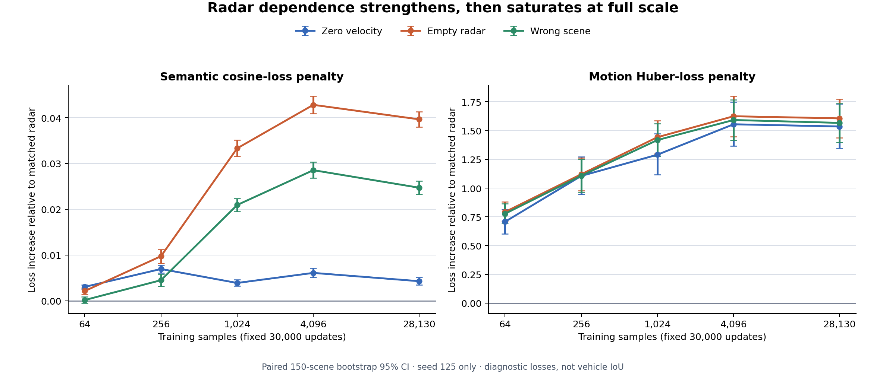

# Radar dependence scaling analysis

## Scope and method

This report analyzes the locked seed-125, one-sweep curve at 64, 256, 1,024, 4,096 and 28,130 training samples. Every point used 30,000 optimizer updates and the same 6,019-frame / 150-scene validation split. Intervals are deterministic paired scene-bootstrap percentile 95% intervals (10,000 resamples). Scenes, rather than temporally adjacent frames, are the resampling unit.

Positive penalties mean that modifying or mismatching radar makes the loss worse than matched radar. They measure radar dependence, not downstream vehicle-segmentation accuracy.



## Semantic cosine-loss penalties

| Training samples | Matched loss | Zero velocity | Empty radar | Wrong scene |
| ---: | ---: | ---: | ---: | ---: |
| 64 | 0.46199 | +0.00304 [+0.00260, +0.00348] | +0.00214 [+0.00143, +0.00286] | +0.00017 [-0.00050, +0.00084] |
| 256 | 0.38045 | +0.00694 [+0.00611, +0.00776] | +0.00974 [+0.00823, +0.01124] | +0.00450 [+0.00319, +0.00582] |
| 1,024 | 0.31452 | +0.00389 [+0.00322, +0.00459] | +0.03330 [+0.03155, +0.03511] | +0.02093 [+0.01951, +0.02234] |
| 4,096 | 0.30256 | +0.00609 [+0.00513, +0.00710] | +0.04281 [+0.04087, +0.04474] | +0.02854 [+0.02681, +0.03029] |
| 28,130 | 0.30538 | +0.00428 [+0.00349, +0.00511] | +0.03964 [+0.03800, +0.04131] | +0.02470 [+0.02322, +0.02621] |

## Motion-loss penalties

| Training samples | Matched loss | Zero velocity | Empty radar | Wrong scene |
| ---: | ---: | ---: | ---: | ---: |
| 64 | 1.58663 | +0.70722 [+0.60235, +0.81666] | +0.79232 [+0.70746, +0.88036] | +0.77715 [+0.69429, +0.86284] |
| 256 | 1.25646 | +1.10560 [+0.94590, +1.27261] | +1.12010 [+0.97616, +1.26263] | +1.10714 [+0.96566, +1.24800] |
| 1,024 | 0.98694 | +1.29008 [+1.11742, +1.47275] | +1.44237 [+1.29699, +1.58709] | +1.41765 [+1.27392, +1.55952] |
| 4,096 | 0.79707 | +1.55477 [+1.36621, +1.74950] | +1.62472 [+1.44664, +1.80070] | +1.59196 [+1.41549, +1.76722] |
| 28,130 | 0.79639 | +1.53571 [+1.34509, +1.73235] | +1.60619 [+1.43853, +1.77455] | +1.56690 [+1.39887, +1.73369] |

## Absolute matched-loss guardrail

| Training samples | Semantic loss | Approx. weighted cosine similarity | Motion loss |
| ---: | ---: | ---: | ---: |
| 64 | 0.46199 | 0.53801 | 1.58663 |
| 256 | 0.38045 | 0.61955 | 1.25646 |
| 1,024 | 0.31452 | 0.68548 | 0.98694 |
| 4,096 | 0.30256 | 0.69744 | 0.79707 |
| 28,130 | 0.30538 | 0.69462 | 0.79639 |

Matched semantic loss improves from 0.46199 at 64 samples to 0.30256 at 4,096 and remains 0.30538 at full scale. Matched motion loss improves from 1.58663 to 0.79639. The diagnostic objectives therefore do not collapse as radar dependence grows, but these losses still do not measure vehicle segmentation.

## Onset and interpretation

- Semantic zero-velocity dependence is persistently positive from **64 samples** by the scene-bootstrap criterion.
- Semantic empty-radar dependence is persistently positive from **64 samples**.
- Semantic wrong-scene dependence is persistently positive from **256 samples**.
- All three motion penalties are persistently positive from **64 samples**; motion dependence is already strong at the first curve point.
- Semantic and motion wrong-scene penalties rise through 4,096 samples and then decline slightly at full scale. The paired full-minus-4,096 changes are reported below; they quantify validation-scene uncertainty but not training-seed uncertainty.
- Semantic wrong-scene full-minus-4,096: **-0.00383** [-0.00460, -0.00309].
- Motion wrong-scene full-minus-4,096: **-0.02506** [-0.06251, +0.01415].
- The supported shape is an onset followed by saturation or a small late decline, not indefinite monotonic growth.
- Persistence across later data scales and positive scene-bootstrap intervals show that the onset is not a single-scene or single-scale blip. Because every point uses seed 125, this is **not** evidence of repeatability across training seeds.
- P11 must compare matched camera-only and fused downstream models on full-validation vehicle IoU. Without that result, the curve establishes radar dependence but not overall model utility.

## Reproduce

```bash
MPLCONFIGDIR=.cache/matplotlib python scripts/analyze_radar_scaling_curve.py \
  --bootstrap-iterations 10000 --bootstrap-seed 20261007
```

The machine-readable result is `artifacts/trainval/radar_scaling_curve_seed125.json`.
