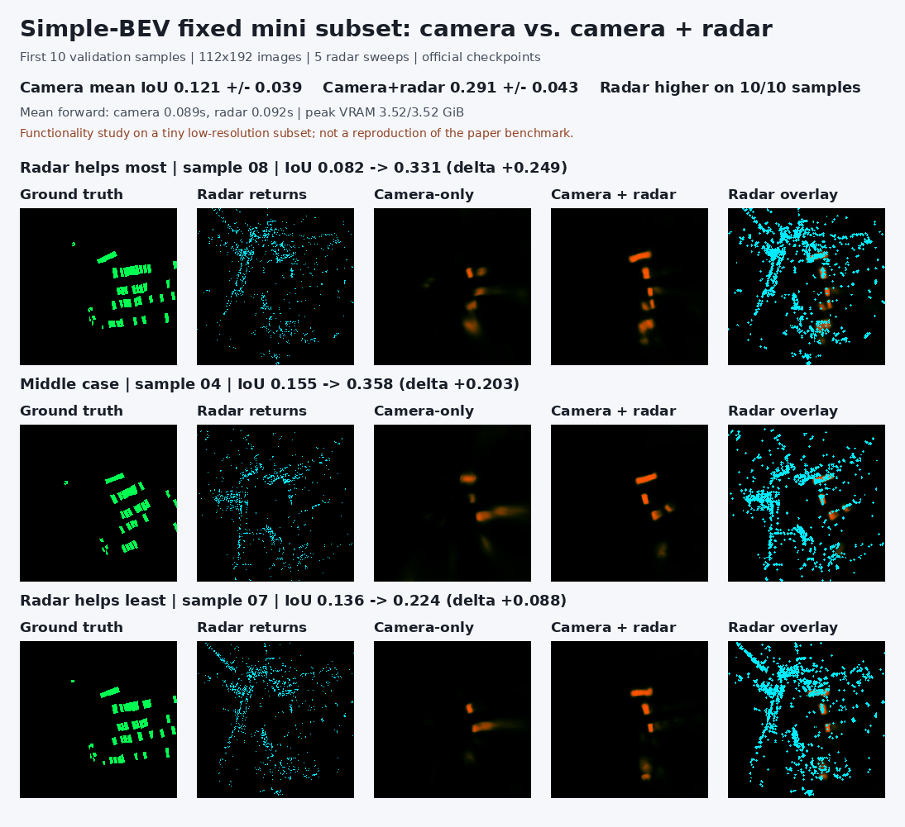

# DD2414 Project: Multi-Sensor and Label-Free BEV Perception

This repository contains the first project milestone for KTH DD2414. We
reproduce the official Simple-BEV camera and camera-plus-radar pipelines on
nuScenes mini, document the data and model flow, and prototype a label-free BEV
learning direction using frozen DINOv2 image features and radar measurements.

The repository is derived from the official
[aharley/simple_bev](https://github.com/aharley/simple_bev) implementation at
commit `be46f0ef71960c233341852f3d9bc3677558ab6d`. The original paper, authors,
license, and citation are retained below. Course-project changes are developed
on branches and reviewed through pull requests so they remain distinguishable
from the upstream code.

## Current milestone

Full nuScenes trainval is installed on the Ubuntu training host; mini was
removed there. Read [the trainval run plan](TRAINVAL_RUN_PLAN.md) for the current
project review and launcher. The exact 64-train / 16-val BEVCar VoxelNet
reproduction completed with motion-only/joint zero-velocity penalties of
`+0.0768`/`+0.0804`. A uniform 64-scene / 16-scene control produced much larger
`+0.7980`/`+0.8602` penalties, exposing scene coverage as a major factor. These
are held-out motion-feature losses, not downstream segmentation accuracy.
Historical mini commands require a separate mini dataset.

- Reproduced camera-only and camera-plus-radar inference, training, checkpoint
  save/reload, and visualization on nuScenes mini.
- Evaluated both official checkpoints on the same fixed 10-sample subset:
  camera-only mean IoU `0.121`, camera-plus-radar mean IoU `0.291`, with radar
  higher on all 10 samples. This is a small functionality study, not a paper
  benchmark.
- Verified the supervised learning loop with a deliberate four-sample overfit:
  mean IoU increased from `0.273` to `0.803` on those same training samples.
- Built radar-anchored DINOv2 BEV targets without using box-derived losses and
  verified a four-sample, randomly initialized student experiment (`1.023` to
  `0.196` mean cosine loss in the pre-push regression).
- Audited all 19 nuScenes radar fields, corrected velocity coordinate rotation,
  and connected a seven-field point/voxel radar encoder producing
  `(B,64,200,200)` features to the camera BEV path.
- Added an independent BEVCar voxel adapter and ran the official random-weight
  radar encoder in isolation on one mini frame, including forward, backward,
  and CUDA-memory checks. Later opt-in fusion and motion probes are recorded
  in the handoff; these are still bounded experiments.
- Ran a four-frame radar-only optimization check against identical cached
  frozen-DINOv2 targets for the lightweight and BEVCar encoders. Both reduced
  training-frame cosine loss; this is not held-out accuracy or camera fusion.
- Extended the check to 12 unseen mini validation frames across two scenes
  and three random seeds. Both reduced target loss, but swapping radar inputs
  across scenes barely changed BEVCar's loss; radar-specific learning is not
  established.
- A fixed-model radar ablation found that removing all radar barely changes
  lightweight loss and does not worsen BEVCar loss. The current target loss
  therefore cannot substantiate a radar-dependent semantic learning claim.
- Added a separate **supervised** Simple-BEV + official BEVCar VoxelNet mini
  demo using human-box-derived labels. On 12 adaptation-held-out mini frames,
  correct radar improved mean IoU over empty/wrong radar across three seeds;
  this does not resolve the self-supervised objective or constitute a matched
  benchmark.



## Project documentation

- [Technical handoff and work log](PROJECT_HANDOFF.md)
- [Full-data radar scaling study](FULL_DATA_RADAR_SCALING_PLAN.md)
- [Project progress and meeting report](PROJECT_PROGRESS.md)
- [Local environment and reproduction commands](SETUP_LOCAL.md)
- [Simple-BEV architecture notes](SIMPLE_BEV_NOTES.md)
- [Label-free extension plan](SELF_SUPERVISED_EXTENSION_PLAN.md)
- [Radar field audit and encoder notes](RADAR_ENCODER_NOTES.md)

The standalone lightweight radar encoder is connected to the camera BEV
feature and passes shape, forward, gradient, empty-radar, checkpoint, and
8 GiB memory checks. The separate BEVCar adapter and official radar encoder
pass a one-frame isolated smoke test. A radar-only, same-target four-frame
optimization comparison now passes. The held-out target-loss improvement
survives two scenes and three seeds, but removal and swap controls do not
establish radar-dependent semantics. Revise the objective/control before
claiming self-supervised radar learning. A separate supervised BEVCar fusion
demo now gives a small radar-dependent IoU gain on mini; motion remains open.

## Quick reproduction

For this trainval host, start with a command preview (does not train):

```bash
bash scripts/run_trainval.sh dual-teacher
```

Review `TRAINVAL_RUN_PLAN.md` before explicitly adding `--execute`. The commands
below describe the historical mini setup.

The scripts default to a `simplebev` Conda environment and nuScenes under
`${HOME}/datasets/nuscenes`. Override `CONDA_ROOT`, `CONDA_ENV`, or
`NUSCENES_ROOT` when your paths differ.

```bash
./scripts/check_environment.sh
./scripts/smoke_test_mini.sh --data-only
./scripts/smoke_test_mini.sh --use-radar --use-metaradar
./scripts/run_mini_subset_eval.sh
./scripts/run_dinov2_mini4.sh
./scripts/run_radar_point_encoder_test.sh
./scripts/run_radar_fusion_test.sh
bash scripts/run_bevcar_voxel_adapter_test.sh
# After checking out official BEVCar as explained in RADAR_ENCODER_NOTES.md:
bash scripts/run_bevcar_encoder_smoke.sh --device cuda
bash scripts/run_radar_dino_tiny.sh --samples 4 --steps 60
bash scripts/run_radar_dino_tiny.sh --samples 4 --steps 60 \
    --heldout-samples 12 --seed-list 125,126,127
bash scripts/run_radar_dino_tiny.sh --samples 4 --steps 60 \
    --heldout-samples 12 --seed-list 125,126,127 --diagnose-radar
BEVCAR_SOURCE_DIR=/path/to/BEVCar bash scripts/run_bevcar_supervised_mini.sh \
    --steps 80 --seed 125
```

Checkpoints, datasets, cached teacher features, logs, and generated model files
are intentionally excluded from version control.

---

## Upstream Simple-BEV project

### Simple-BEV: What Really Matters for Multi-Sensor BEV Perception?

This is the official code release for our arXiv paper on BEV perception. 

[[Paper](https://arxiv.org/abs/2206.07959)] [[Project Page](https://simple-bev.github.io/)]


## Requirements

The lines below should set up a fresh environment with everything you need: 
```
conda create --name bev
source activate bev 
conda install pytorch=1.12.0 torchvision=0.13.0 cudatoolkit=11.3 -c pytorch
conda install pip
pip install -r requirements.txt
```

You will also need to download [nuScenes](https://www.nuscenes.org/) and its dependencies.


## Pre-trained models

To download a pre-trained camera-only model, run this:

```
sh get_rgb_model.sh
```
When evaluated at `res_scale=2` (`448x800`), this model should show a final trainval mean IOU of `47.6`, which is slightly higher than the number in our arXiv paper (`47.4`). 

To download a pre-trained camera-plus-radar model, run this:

```
sh get_rad_model.sh
```
When evaluated at `res_scale=2` (`448x800`) and `nsweeps=5`, this model should show a final trainval mean IOU of `55.8`, which is slightly higher than the number in our arXiv paper (`55.7`).

Note there is some variance across training runs, which alters results by +-0.1 IOU. It should be possible to cherry-pick checkpoints along the training process, but we recommend to pick `max_iters` and just report the final number (as we have done).  

## Training

A sample training command is included in `train.sh`.

To train a model that matches our pre-trained camera-only model, run a command like this:

```
python train_nuscenes.py \
       --exp_name="rgb_mine" \
       --max_iters=25000 \
       --log_freq=1000 \
       --dset='trainval' \
       --batch_size=8 \
       --grad_acc=5 \
       --use_scheduler=True \
       --data_dir='../nuscenes' \
       --log_dir='logs_nuscenes' \
       --ckpt_dir='checkpoints' \
       --res_scale=2 \
       --ncams=6 \
       --encoder_type='res101' \
       --do_rgbcompress=True \
       --device_ids=[0,1,2,3]
```


To train a model that matches our pre-trained camera-plus-radar model, run a command like this:

```
python train_nuscenes.py \
       --exp_name="rad_mine" \
       --max_iters=25000 \
       --log_freq=1000 \
       --dset='trainval' \
       --batch_size=8 \
       --grad_acc=5 \
       --use_scheduler=True \
       --data_dir='../nuscenes' \
       --log_dir='logs_nuscenes' \
       --ckpt_dir='checkpoints' \
       --res_scale=2 \
       --ncams=6 \
       --nsweeps=5 \
       --encoder_type='res101' \
       --use_radar=True \
       --use_metaradar=True \
       --use_radar_filters=False \
       --device_ids=[0,1,2,3]
```


## Evaluation

A sample evaluation command is included in `eval.sh`.

To evaluate a camera-only model, run a command like this:
```
python eval_nuscenes.py \
       --batch_size=16 \
       --data_dir='../nuscenes' \
       --log_dir='logs_eval_nuscenes_bevseg' \
       --init_dir='checkpoints/8x5_5e-4_rgb12_22:43:46' \
       --res_scale=2 \
       --device_ids=[0,1,2,3]
```

To evaluate a camera-plus-radar model, run a command like this:
```
python eval_nuscenes.py \
       --batch_size=16 \
       --data_dir='../nuscenes' \
       --log_dir='logs_eval_nuscenes' \
       --init_dir='checkpoints/8x5_5e-4_rad25_18:55:34' \
       --use_radar=True \
       --use_metaradar=True \
       --use_radar_filters=False \
       --res_scale=2 \
       --nsweeps=5 \
       --device_ids=[0,1,2,3]
```


## Code notes
### Tensor shapes

We maintain consistent axis ordering across all tensors. In general, the ordering is `B,S,C,Z,Y,X`, where

- `B`: batch
- `S`: sequence (for temporal or multiview data)
- `C`: channels
- `Z`: depth
- `Y`: height
- `X`: width

This ordering stands even if a tensor is missing some dims. For example, plain images are `B,C,Y,X` (as is the pytorch standard).

### Axis directions

- Z: forward
- Y: down
- X: right

This means the top-left of an image is "0,0", and coordinates increase as you travel right and down. `Z` increases forward because it's the depth axis.

### Geometry conventions

We write pointclouds/tensors and transformations as follows:

- `p_a` is a point named `p` living in `a` coordinates.
- `a_T_b` is a transformation that takes points from coordinate system `b` to coordinate system `a`.

For example, `p_a = a_T_b * p_b`.

This convention lets us easily keep track of valid transformations, such as
`point_a = a_T_b * b_T_c * c_T_d * point_d`.

For example, an intrinsics matrix is `pix_T_cam`. An extrinsics matrix is `cam_T_world`. 

In this project's context, we often need something like this:
`xyz_cam0 = cam0_T_cam1 * cam1_T_velodyne * xyz_velodyne`


## Citation

If you use this code for your research, please cite:

**Simple-BEV: What Really Matters for Multi-Sensor BEV Perception?**.
[Adam W. Harley](https://adamharley.com/),
[Zhaoyuan Fang](https://zfang399.github.io/),
[Jie Li](https://www.tri.global/about-us/jie-li/),
[Rares Ambrus](https://www.csc.kth.se/~raambrus/),
[Katerina Fragkiadaki](http://cs.cmu.edu/~katef/). In arXiv:2206.07959.

Bibtex:
```
@inproceedings{harley2022simple,
  title={Simple-{BEV}: What Really Matters for Multi-Sensor BEV Perception?},
  author={Adam W. Harley and Zhaoyuan Fang and Jie Li and Rares Ambrus and Katerina Fragkiadaki},
  booktitle={arXiv:2206.07959},
  year={2022}
}
```
